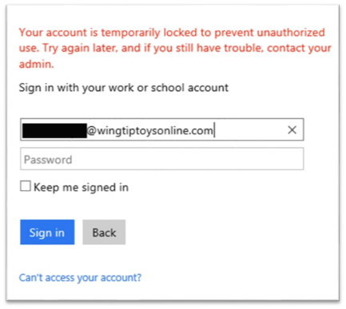

# A multi-tiered approach to Azure AD password security

This article discusses some best practices you can follow as a user or as an administrator to protect your Azure Active Directory (Azure AD) or Microsoft Account.

 > [!NOTE]
 > **Are you here because you're having problems signing in?** If so, [here's how you can change and reset your own password](user-help/active-directory-passwords-update-your-own-password.md).
 >
 > Azure AD administrators can reset user passwords using the guidance in the article [Reset the password for a user in Azure Active Directory](fundamentals/active-directory-users-reset-password-azure-portal.md).
 >

## Password requirements

Azure AD incorporates the following common approaches to securing passwords:

* Password length requirements
* Password complexity requirements
* Regular and periodic password expiration

For information about password reset in Azure Active Directory, see the topic [Azure AD self-service password reset for the IT professional](user-help/active-directory-passwords-update-your-own-password.md).

## Azure AD password protections

Azure AD and the Microsoft Account System use industry proven approaches to ensure secure protection of user and administrator passwords including:

* Dynamically banned passwords
* Smart Password Lockout

For information about password management based on current research, see the whitepaper [Password Guidance](https://aka.ms/passwordguidance).

### Dynamically banned passwords

Azure AD and Microsoft Accounts safeguard password protection by dynamically banning commonly used passwords. The Azure AD Identity Protection team routinely analyzes banned password lists, preventing users from selecting commonly used passwords. This service is available to Azure AD and the Microsoft Account Service customers.

When creating passwords, it is important for administrators to encourage users to choose password phrases that include a unique combination of letters, numbers, characters, or words. This approach helps to make user passwords nearly impossible to be compromised but easier for users to remember.

#### Password breaches

Microsoft is always working to stay one step ahead of cyber-criminals.

The Azure AD Identity Protection team continually analyzes passwords that are commonly used. Cyber-criminals also use similar strategies to inform their attacks, such as building a [rainbow table](https://en.wikipedia.org/wiki/Rainbow_table) for cracking password hashes.

Microsoft continually analyzes [data breaches](https://www.privacyrights.org/data-breaches) to maintain a dynamically updated banned password list, which ensures that vulnerable passwords are banned before they become a real threat to Azure AD customers. For more information about our current security efforts, see the [Microsoft Security Intelligence Report](https://www.microsoft.com/security/sir/default.aspx).

### Smart Password Lockout

When Azure AD detects a potential cyber-criminal trying to hack into a user password, we lock the user account with Smart Password Lockout. Azure AD is designed to determine the risk associated with specific login sessions. Then using the most up-to-date security data, we apply lockout semantics to stop cyber threats.

If a user is locked out of Azure AD, their screen looks similar to the one that follows:

  

For other Microsoft accounts, their screen looks similar to the one that follows:

  

For information about password reset in Azure Active Directory, see the topic [Azure AD self-service password reset for the IT professional](user-help/active-directory-passwords-update-your-own-password.md).

  >[!NOTE]
  >If you are an Azure AD administrator, you may want to use [Windows Hello](https://www.microsoft.com/windows/windows-hello) to avoid having your users create traditional passwords altogether.
  >

## Next steps

* [How to update your own password](user-help/active-directory-passwords-update-your-own-password.md)
* [The fundamentals of Azure identity management](fundamentals-identity.md)
* [Report on password reset activity](authentication/howto-sspr-reporting.md)
