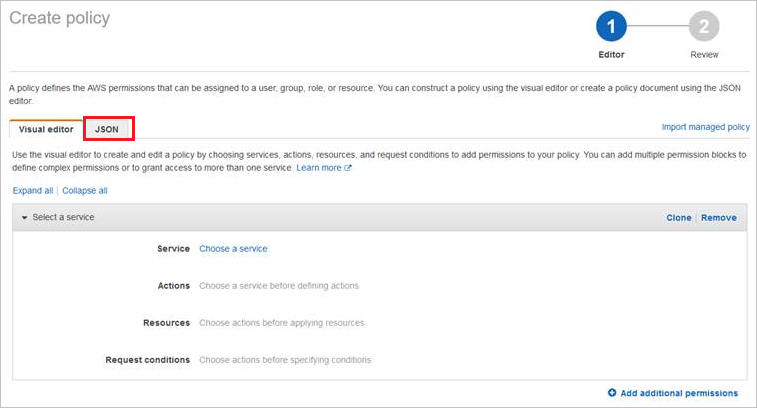
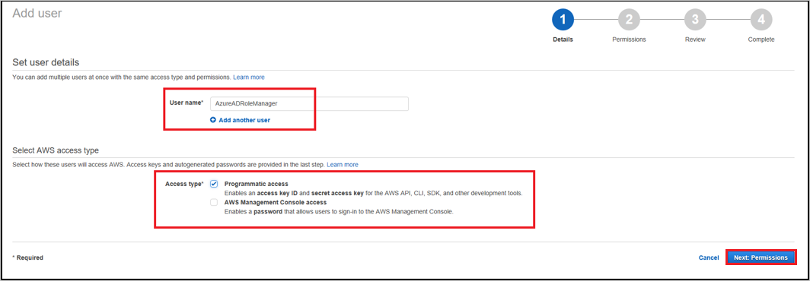
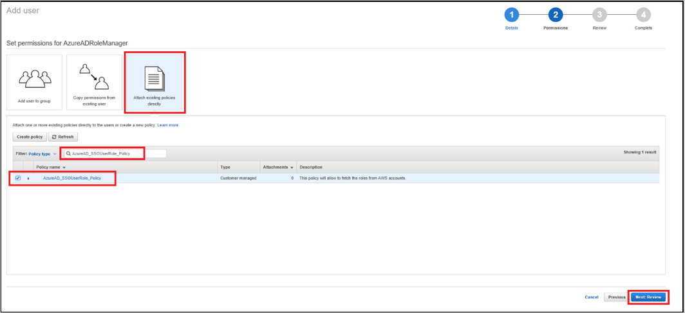

# Tutorial: Azure Active Directory integration with Amazon Web Services (AWS)

In this tutorial, you learn how to integrate Amazon Web Services (AWS) with Azure Active Directory (Azure AD).

Integrating Amazon Web Services (AWS) with Azure AD provides you with the following benefits:

- You can control in Azure AD who has access to Amazon Web Services (AWS).
- You can enable your users to automatically get signed-on to Amazon Web Services (AWS) (Single Sign-On) with their Azure AD accounts.
- You can manage your accounts in one central location - the Azure portal.

If you want to know more details about SaaS app integration with Azure AD, see [what is application access and single sign-on with Azure Active Directory](../manage-apps/what-is-single-sign-on.md).

## Prerequisites

To configure Azure AD integration with Amazon Web Services (AWS), you need the following items:

- An Azure AD subscription
- An Amazon Web Services (AWS) single sign-on enabled subscription

> [!NOTE]
> To test the steps in this tutorial, we do not recommend using a production environment.

To test the steps in this tutorial, you should follow these recommendations:

- Do not use your production environment, unless it is necessary.
- If you don't have an Azure AD trial environment, you can [get a one-month trial](https://azure.microsoft.com/pricing/free-trial/).

## Scenario description
In this tutorial, you test Azure AD single sign-on in a test environment. 
The scenario outlined in this tutorial consists of two main building blocks:

1. Adding Amazon Web Services (AWS) from the gallery
2. Configuring and testing Azure AD single sign-on

## Adding Amazon Web Services (AWS) from the gallery
To configure the integration of Amazon Web Services (AWS) into Azure AD, you need to add Amazon Web Services (AWS) from the gallery to your list of managed SaaS apps.

**To add Amazon Web Services (AWS) from the gallery, perform the following steps:**

1. In the **[Azure portal](https://portal.azure.com)**, on the left navigation panel, click **Azure Active Directory** icon. 

	![The Azure Active Directory button][1]

2. Navigate to **Enterprise applications**. Then go to **All applications**.

	![The Enterprise applications blade][2]
	
3. To add new application, click **New application** button on the top of dialog.

	![The New application button][3]

4. In the search box, type **Amazon Web Services (AWS)**, select **Amazon Web Services (AWS)** from result panel then click **Add** button to add the application.

	_addfromgallery.png)

## Configure and test Azure AD single sign-on

In this section, you configure and test Azure AD single sign-on with Amazon Web Services (AWS) based on a test user called "Britta Simon".

For single sign-on to work, Azure AD needs to know what the counterpart user in Amazon Web Services (AWS) is to a user in Azure AD. In other words, a link relationship between an Azure AD user and the related user in Amazon Web Services (AWS) needs to be established.

In Amazon Web Services (AWS), assign the value of the **user name** in Azure AD as the value of the **Username** to establish the link relationship.

To configure and test Azure AD single sign-on with Amazon Web Services (AWS), you need to complete the following building blocks:

1. **[Configure Azure AD Single Sign-On](#configure-azure-ad-single-sign-on)** - to enable your users to use this feature.
2. **[Create an Azure AD test user](#create-an-azure-ad-test-user)** - to test Azure AD single sign-on with Britta Simon.
3. **[Create an Amazon Web Services (AWS) test user](#create-an-amazon-web-services-aws-test-user)** - to have a counterpart of Britta Simon in Amazon Web Services (AWS) that is linked to the Azure AD representation of user.
4. **[Assign the Azure AD test user](#assign-the-azure-ad-test-user)** - to enable Britta Simon to use Azure AD single sign-on.
5. **[Test single sign-on](#test-single-sign-on)** - to verify whether the configuration works.

### Configure Azure AD single sign-on

In this section, you enable Azure AD single sign-on in the Azure portal and configure single sign-on in your Amazon Web Services (AWS) application.

**To configure Azure AD single sign-on with Amazon Web Services (AWS), perform the following steps:**

1. In the Azure portal, on the **Amazon Web Services (AWS)** application integration page, click **Single sign-on**.

	![Configure single sign-on link][4]

2. On the **Single sign-on** dialog, select **Mode** as	**SAML-based Sign-on** to enable single sign-on.
 
	_samlbase.png)

3. On the **Amazon Web Services (AWS) Domain and URLs** section, the user does not have to perform any steps as the app is already pre-integrated with Azure.

	_url.png)

4. The Amazon Web Services (AWS) Software application expects the SAML assertions in a specific format. Configure the following claims for this application. You can manage the values of these attributes from the "**User Attributes**" section on application integration page. The following screenshot shows an example for this.

	_attribute.png)	

5. In the **User Attributes** section on the **Single sign-on** dialog, configure SAML token attribute as shown in the image above and perform the following steps:
	
	| Attribute Name  | Attribute Value | Namespace |
	| --------------- | --------------- | --------------- |
	| RoleSessionName | user.userprincipalname | https://aws.amazon.com/SAML/Attributes |
	| Role 			  | user.assignedroles |  https://aws.amazon.com/SAML/Attributes |
	
	>[!TIP]
	>You need to configure the user provisioning in Azure AD to fetch all the roles from AWS Console. Refer the provisioning steps below.

	a. Click **Add attribute** to open the **Add Attribute** dialog.

	

	

	b. In the **Name** textbox, type the attribute name shown for that row.

	c. From the **Value** list, type the attribute value shown for that row.

	d. In the **Namespace** textbox, type the namespace value shown for that row.
	
	d. Click **Ok**.

6. On the **SAML Signing Certificate** section, click **Metadata XML** and then save the metadata file on your computer.

	_certificate.png) 

7. Click **Save** button.

	

8. In a different browser window, sign-on to your Amazon Web Services (AWS) company site as administrator.

9. Click **AWS Home**.
   
    ![Configure Single Sign-On home][11]

10. Click **Identity and Access Management**. 
   
    ![Configure Single Sign-On Identity][12]

11. Click **Identity Providers**, and then click **Create Provider**. 
   
    ![Configure Single Sign-On Provider][13]

12. On the **Configure Provider** dialog page, perform the following steps: 
   
    ![Configure Single Sign-On dialog][14]
 
  	a. As **Provider Type**, select **SAML**.

  	b. In the **Provider Name** textbox, type a provider name (for example: *WAAD*).

  	c. To upload your downloaded **metadata file** from Azure portal, click **Choose File**.

  	d. Click **Next Step**.

13. On the **Verify Provider Information** dialog page, click **Create**. 
    
    ![Configure Single Sign-On Verify][15]

14. Click **Roles**, and then click **Create role**. 
    
    ![Configure Single Sign-On Roles][16]

15. On the **Create role** page, perform the following steps:  
    
    ![Configure Single Sign-On Trust][19] 

    a. Select **SAML 2.0 federation** under **Select type of trusted entity**.

	b. Under **Choose a SAML 2.0 Provider section**, select the **SAML provider** you have created previously (for example: *WAAD*)

	c. Select **Allow programmatic and AWS Management Console access**.
  
    d. Click **Next: Permissions**.

16. On the **Attach Permissions Policies** dialog, you don't need to attach any policy. Click **Next: Review**.  
    
    ![Configure Single Sign-On Policy][33]

17. On the **Review** dialog, perform the following steps:   
    
    ![Configure Single Sign-On Review][34] 

	a. In the **Role name** textbox, enter your Role name.

	b. In the **Role description** textbox, enter the description.

    c. Click **Create Role**.

    d. Create as many roles as needed and map them to the Identity Provider.

18. Use AWS service account credentials for fetching the roles from AWS account in Azure AD User Provisioning. For this, open the AWS console home.

19. Click on **Services** -> **Security, Identity& Compliance** -> **IAM**.

	

20. Select the **Policies** tab in the IAM section.

	

21. Create a new policy by clicking on **Create policy** for fetching the roles from AWS account in Azure AD User Provisioning.

	

22. Create your own policy to fetch all the roles from AWS accounts by performing the following steps:

	

	a. In the **“Create policy”** section click on **“JSON”** tab.

	b. In the policy document, add the below JSON.
	
	```
	
	{

	"Version": "2012-10-17",

	"Statement": [

	{

	"Effect": "Allow",
		
	"Action": [
		
	"iam:ListRoles"
		
	],

	"Resource": "*"

	}

	]

	}
	
	```

	c. Click on **Review Policy button** to validate the policy.

	

23. Define the **new policy** by performing the following steps:

	

	a. Provide the **Policy Name** as **AzureAD_SSOUserRole_Policy**.

	b. You can provide **Description** to the policy as **This policy will allow to fetch the roles from AWS accounts**.
	
	c. Click on **“Create Policy”** button.

24.	Create a new user account in the AWS IAM Service by performing the following steps:

	a. Click on **Users** navigation in the AWS IAM console.

	
	
	b. Click on **Add user** button to create a new user.

	

	c. In the **Add user** section, perform the following steps:
	
	
	
	* Enter the user name as **AzureADRoleManager**.
	
	* In the Access type, select the **Programmatic access** option. This way the user can invoke the APIs and fetch the roles from AWS account.
	
	* Click on the **Next Permissions** button in the bottom right corner.

25. Now create a new policy for this user by performing the following steps:

	
	
	a. Click on the **Attach existing policies directly** button.

	b. Search for the newly created policy in the filter section **AzureAD_SSOUserRole_Policy**.
	
	c. Select the **policy** and then click on the **Next: Review** button.

26.	Review the policy to the attached user by performing following steps:

	
	
	a. Review the user name, access type, and policy mapped to the user.
	
	b. Click on the **Create user** button at the bottom right corner to create the user.

27. Download the user credentials of a user by performing following steps:

	
	
	a. Copy the user **Access key ID** and **Secret access key**.
	
	b. Enter these credentials into Azure AD user provisioning section to fetch the roles from AWS console.
	
	c. Click on **Close** button at the bottom.

28. Navigate to **User Provisioning** section of Amazon Web Services app in Azure AD Management Portal.

	

29. Enter the **Access Key** and **Secret** in the **Client Secret** and **Secret Token** field respectively.

	
	
	a. Enter the AWS user access key in the **clientsecret** field.
	
	b. Enter the AWS user secret in the **Secret Token** field.
	
	c. Click on the **Test Connection** button and you should able to successfully test this connection.

	d. Save the setting by clicking on the **Save** button at the top.
 
30. Now make sure that you enable the Provisioning Status **On** in the Settings section by making the switch on and then clicking on the **Save** button at the top.

	

> [!Note]
> If you want to integrate multiple AWS accounts to one Azure account for Single Sign on, please refer [this](https://docs.microsoft.com/azure/active-directory/active-directory-saas-aws-multi-accounts-tutorial) article. 


### Create an Azure AD test user

The objective of this section is to create a test user in the Azure portal called Britta Simon.

   ![Create an Azure AD test user][100]

**To create a test user in Azure AD, perform the following steps:**

1. In the Azure portal, in the left pane, click the **Azure Active Directory** button.

    

2. To display the list of users, go to **Users and groups**, and then click **All users**.

    

3. To open the **User** dialog box, click **Add** at the top of the **All Users** dialog box.

    

4. In the **User** dialog box, perform the following steps:

    

    a. In the **Name** box, type **BrittaSimon**.

    b. In the **User name** box, type the email address of user Britta Simon.

    c. Select the **Show Password** check box, and then write down the value that's displayed in the **Password** box.

    d. Click **Create**.
 
### Create an Amazon Web Services (AWS) test user

The objective of this section is to create a user called Britta Simon in Amazon Web Services (AWS). Amazon Web Services (AWS) doesn't need a user to be created in their system for SSO, so you don't need to perform any action here.

### Assign the Azure AD test user

In this section, you enable Britta Simon to use Azure single sign-on by granting access to Amazon Web Services (AWS).

![Assign the user role][200] 

**To assign Britta Simon to Amazon Web Services (AWS), perform the following steps:**

1. In the Azure portal, open the applications view, and then navigate to the directory view and go to **Enterprise applications** then click **All applications**.

	![Assign User][201] 

2. In the applications list, select **Amazon Web Services (AWS)**.

	_app.png)  

3. In the menu on the left, click **Users and groups**.

	![The "Users and groups" link][202]

4. Click **Add** button. Then select **Users and groups** on **Add Assignment** dialog.

	![The Add Assignment pane][203]

5. On **Users and groups** dialog, select **Britta Simon** in the Users list.

6. Click **Select** button on **Users and groups** dialog.

7. Click **Assign** button on **Add Assignment** dialog.
	
### Test single sign-on

In this section, you test your Azure AD single sign-on configuration using the Access Panel.

When you click the Amazon Web Services (AWS) tile in the Access Panel, you should get automatically signed-on to your Amazon Web Services (AWS) application. For more information about the Access Panel, see [Introduction to the Access Panel](../user-help/active-directory-saas-access-panel-introduction.md). 

## Additional resources

* [List of Tutorials on How to Integrate SaaS Apps with Azure Active Directory](tutorial-list.md)
* [What is application access and single sign-on with Azure Active Directory?](../manage-apps/what-is-single-sign-on.md)


<!--Image references-->

[1]: ./media/amazon-web-service-tutorial/tutorial_general_01.png
[2]: ./media/amazon-web-service-tutorial/tutorial_general_02.png
[3]: ./media/amazon-web-service-tutorial/tutorial_general_03.png
[4]: ./media/amazon-web-service-tutorial/tutorial_general_04.png

[100]: ./media/amazon-web-service-tutorial/tutorial_general_100.png

[200]: ./media/amazon-web-service-tutorial/tutorial_general_200.png
[201]: ./media/amazon-web-service-tutorial/tutorial_general_201.png
[202]: ./media/amazon-web-service-tutorial/tutorial_general_202.png
[203]: ./media/amazon-web-service-tutorial/tutorial_general_203.png
[11]: ./media/amazon-web-service-tutorial/ic795031.png
[12]: ./media/amazon-web-service-tutorial/ic795032.png
[13]: ./media/amazon-web-service-tutorial/ic795033.png
[14]: ./media/amazon-web-service-tutorial/ic795034.png
[15]: ./media/amazon-web-service-tutorial/ic795035.png
[16]: ./media/amazon-web-service-tutorial/ic795022.png
[17]: ./media/amazon-web-service-tutorial/ic795023.png
[18]: ./media/amazon-web-service-tutorial/ic795024.png
[19]: ./media/amazon-web-service-tutorial/ic795025.png
[32]: ./media/amazon-web-service-tutorial/ic7950251.png
[33]: ./media/amazon-web-service-tutorial/ic7950252.png
[35]: ./media/amazon-web-service-tutorial/tutorial_amazonwebservices_provisioning.png
[34]: ./media/amazon-web-service-tutorial/ic7950253.png
[36]: ./media/amazon-web-service-tutorial/tutorial_amazonwebservices_securitycredentials.png
[37]: ./media/amazon-web-service-tutorial/tutorial_amazonwebservices_securitycredentials_continue.png
[38]: ./media/amazon-web-service-tutorial/tutorial_amazonwebservices_createnewaccesskey.png
[39]: ./media/amazon-web-service-tutorial/tutorial_amazonwebservices_provisioning_automatic.png
[40]: ./media/amazon-web-service-tutorial/tutorial_amazonwebservices_provisioning_testconnection.png
[41]: ./media/amazon-web-service-tutorial/tutorial_amazonwebservices_provisioning_on.png
