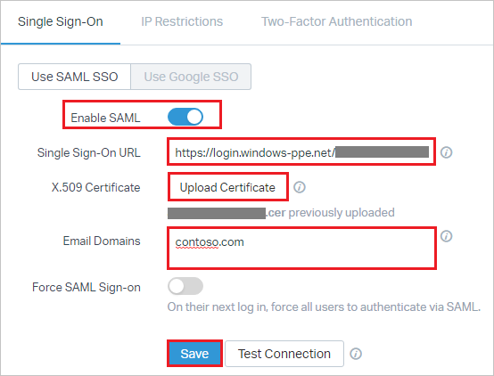
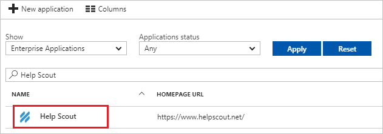

# Tutorial: Azure Active Directory integration with Help Scout

In this tutorial, you learn how to integrate Help Scout with Azure Active Directory (Azure AD).

Integrating Help Scout with Azure AD provides you with the following benefits:

- You can control in Azure AD who has access to Help Scout.
- You can enable your users to automatically get signed-on to Help Scout (Single Sign-On) with their Azure AD accounts.
- You can manage your accounts in one central location - the Azure portal.

If you want to know more details about SaaS app integration with Azure AD, see [what is application access and single sign-on with Azure Active Directory](../manage-apps/what-is-single-sign-on.md).

## Prerequisites

To configure Azure AD integration with Help Scout, you need the following items:

- An Azure AD subscription
- A Help Scout single-sign on enabled subscription

To test the steps in this tutorial, you should follow these recommendations:

- Do not use your production environment, unless it is necessary.
- If you don't have an Azure AD trial environment, you can [get a one-month trial](https://azure.microsoft.com/pricing/free-trial/).

## Scenario description
In this tutorial, you test Azure AD single sign-on in a test environment. 
The scenario outlined in this tutorial consists of two main building blocks:

1. Adding Help Scout from the gallery
2. Configuring and testing Azure AD single sign-on

## Adding Help Scout from the gallery
To configure the integration of Help Scout into Azure AD, you need to add Help Scout from the gallery to your list of managed SaaS apps.

**To add Help Scout from the gallery, perform the following steps:**

1. In the **[Azure portal](https://portal.azure.com)**, on the left navigation panel, click **Azure Active Directory** icon. 

	![The Azure Active Directory button][1]

2. Navigate to **Enterprise applications**. Then go to **All applications**.

	![The Enterprise applications blade][2]
	
3. To add new application, click **New application** button on the top of dialog.

	![The New application button][3]

4. In the search box, type **Help Scout**, select **Help Scout** from result panel then click **Add** button to add the application.

	

## Configure and test Azure AD single sign-on

In this section, you configure and test Azure AD single sign-on with Help Scout based on a test user called "Britta Simon."

For single sign-on to work, Azure AD needs to know what the counterpart user in Help Scout is to a user in Azure AD. In other words, a link relationship between an Azure AD user and the related user in Help Scout needs to be established.

Help Scout uses email addresses for logins, so to establish the link relationship, use the same **email address** as **user name** in Azure AD.

To configure and test Azure AD single sign-on with Help Scout, you need to complete the following building blocks:

1. **[Configure Azure AD Single Sign-On](#configure-azure-ad-single-sign-on)** - to enable your users to use this feature.
2. **[Create an Azure AD test user](#create-an-azure-ad-test-user)** - to test Azure AD single sign-on with Britta Simon.
3. **[Create a Help Scout test user](#create-a-help-scout-test-user)** - to have a counterpart of Britta Simon in Help Scout that is linked to the Azure AD representation of user.
4. **[Assign the Azure AD test user](#assign-the-azure-ad-test-user)** - to enable Britta Simon to use Azure AD single sign-on.
5. **[Test single sign-on](#test-single-sign-on)** - to verify whether the configuration works.

### Configure Azure AD single sign-on

In this section, you enable Azure AD single sign-on in the Azure portal and configure single sign-on in your Help Scout application.

**To configure Azure AD single sign-on with Help Scout, perform the following steps:**

1. In the Azure portal, on the **Help Scout** application integration page, click **Single sign-on**.

	![Configure single sign-on link][4]

2. On the **Single sign-on** dialog, select **Mode** as	**SAML-based Sign-on** to enable single sign-on.
 
	

3. On the **Help Scout Domain and URLs** section, perform the following steps if you wish to configure the application in **IDP** initiated mode:

	

    a. **Identifier** is the **"Audience URI (Service Provider Entity ID)"** from Help Scout, starts with `urn:`

	b. **Reply URL** is the **"Post-back URL (Assertion Consumer Service URL)"** from Help Scout, starts with `https://` 

	> [!NOTE] 
	> The values in these URLs are for demonstration only. You need to update these values from actual Reply URL and Identifier. You get these values from the **Single Sign-On** tab under Authentication section, which is explained later in the tutorial.

4. If you wish to configure the application in **SP** initiated mode, check **Show advanced URL settings** and perform the following step:

	

    In the **Sign-on URL** textbox, type a URL as: `https://secure.helpscout.net/members/login/`
	 
5. On the **SAML Signing Certificate** section, click **Certificate (Base64)** and then save the certificate file on your computer.

	 

6. Click **Save** button.

	

7. On the **Help Scout Configuration** section, click **Configure Help Scout** to open **Configure sign-on** window. Copy the **SAML Single Sign-On Service URL** from the **Quick Reference section**.

	 

8. In a different web browser window, log in to your Help Scout company site as an administrator.

9. Once you are logged in click on **"Manage"** from the top menu and then select **"Company"** from the dropdown menu.

	 
 
10. Select **"Authentication"** from the left-hand menu. 

	 

11. This takes you to the SAML settings section and perform the following steps:

	 
 
	a. Copy the **Post-back URL (Assertion Consumer Service URL)** value and paste the value in the **Reply URL** box in the Azure portal, under Help Scout **Domain and URLs** section.
	
	b. Copy the **Audience URI (Service Provider Entity ID)** value and paste the value in the **Identifier** box in the Azure portal, under Help Scout **Domain and URLs** section.

12. Toggle **Enable SAML** on and perform the following steps:

	 
 
	a. In **Single Sign-On URL** textbox, paste the value of **Single Sign-On Service URL**, which you have copied from Azure portal.
	
	b. Click **Upload Certificate** to upload the **Certificate(Base64)** downloaded from Azure portal.

	c. Enter your organization's email domain(s) e.x.- `contoso.com` in the **Email Domains** textbox. You can separate multiple domains with a comma. Anytime a Help Scout User or Administrator who enters that specific domain on the [Help Scout log-in page](https://secure.helpscout.net/members/login/) will be routed to Identity Provider to authenticate with their credentials.

	d. Lastly, you can toggle **Force SAML Sign-on** if you want Users to only log in to Help Scout via through this method. If you'd still like to leave the option for them to sign in with their Help Scout credentials, you can leave it toggled off. Even if this is enabled, an Account Owner will always be able to log in to Help Scout with their account password.

	e. Click **Save**.

> [!TIP]
> You can now read a concise version of these instructions inside the [Azure portal](https://portal.azure.com), while you are setting up the app!  After adding this app from the **Active Directory > Enterprise Applications** section, simply click the **Single Sign-On** tab and access the embedded documentation through the **Configuration** section at the bottom. You can read more about the embedded documentation feature here: [Azure AD embedded documentation]( https://go.microsoft.com/fwlink/?linkid=845985)

### Create an Azure AD test user

The objective of this section is to create a test user in the Azure portal called Britta Simon.

   ![Create an Azure AD test user][100]

**To create a test user in Azure AD, perform the following steps:**

1. In the Azure portal, in the left pane, click the **Azure Active Directory** button.

    

2. To display the list of users, go to **Users and groups**, and then click **All users**.

    

3. To open the **User** dialog box, click **Add** at the top of the **All Users** dialog box.

    

4. In the **User** dialog box, perform the following steps:

    

    a. In the **Name** box, type **BrittaSimon**.

    b. In the **User name** box, type the email address of user Britta Simon.

    c. Select the **Show Password** check box, and then write down the value that's displayed in the **Password** box.

    d. Click **Create**.
 
### Create a Help Scout test user

The objective of this section is to create a user called Britta Simon in Help Scout. Help Scout supports just-in-time provisioning, which is by default enabled.

There is no action item for you in this section. If a user doesn't already exist in Help Scout, a new one is created when you attempt to access Help Scout.

### Assign the Azure AD test user

In this section, you enable Britta Simon to use Azure single sign-on by granting access to Help Scout.

![Assign the user role][200] 

**To assign Britta Simon to Help Scout, perform the following steps:**

1. In the Azure portal, open the applications view, and then navigate to the directory view and go to **Enterprise applications** then click **All applications**.

	![Assign User][201] 

2. In the applications list, select **Help Scout**.

	  

3. In the menu on the left, click **Users and groups**.

	![The "Users and groups" link][202]

4. Click **Add** button. Then select **Users and groups** on **Add Assignment** dialog.

	![The Add Assignment pane][203]

5. On **Users and groups** dialog, select **Britta Simon** in the Users list.

6. Click **Select** button on **Users and groups** dialog.

7. Click **Assign** button on **Add Assignment** dialog.
	
### Test single sign-on

In this section, you test your Azure AD single sign-on configuration using the Access Panel.

When you click the Help Scout tile in the Access Panel, you should get automatically signed-on to your Help Scout application.
For more information about the Access Panel, see [Introduction to the Access Panel](../user-help/active-directory-saas-access-panel-introduction.md). 

## Additional resources

* [List of Tutorials on How to Integrate SaaS Apps with Azure Active Directory](tutorial-list.md)
* [What is application access and single sign-on with Azure Active Directory?](../manage-apps/what-is-single-sign-on.md)

<!--Image references-->

[1]: ./media/helpscout-tutorial/tutorial_general_01.png
[2]: ./media/helpscout-tutorial/tutorial_general_02.png
[3]: ./media/helpscout-tutorial/tutorial_general_03.png
[4]: ./media/helpscout-tutorial/tutorial_general_04.png

[100]: ./media/helpscout-tutorial/tutorial_general_100.png

[200]: ./media/helpscout-tutorial/tutorial_general_200.png
[201]: ./media/helpscout-tutorial/tutorial_general_201.png
[202]: ./media/helpscout-tutorial/tutorial_general_202.png
[203]: ./media/helpscout-tutorial/tutorial_general_203.png

