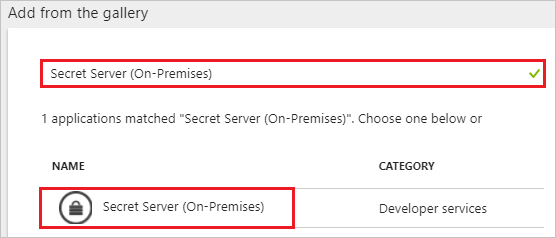
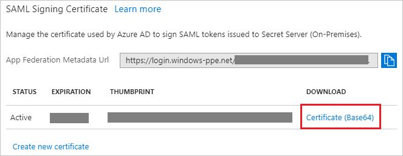

# Tutorial: Azure Active Directory integration with Secret Server (On-Premises)

In this tutorial, you learn how to integrate Secret Server (On-Premises) with Azure Active Directory (Azure AD).

Integrating Secret Server (On-Premises) with Azure AD provides you with the following benefits:

- You can control in Azure AD who has access to Secret Server (On-Premises).
- You can enable your users to automatically get signed-on to Secret Server (On-Premises) (Single Sign-On) with their Azure AD accounts.
- You can manage your accounts in one central location - the Azure portal.

If you want to know more details about SaaS app integration with Azure AD, see [what is application access and single sign-on with Azure Active Directory](../manage-apps/what-is-single-sign-on.md).

## Prerequisites

To configure Azure AD integration with Secret Server (On-Premises), you need the following items:

- An Azure AD subscription
- A Secret Server (On-Premises) single sign-on enabled subscription

> [!NOTE]
> To test the steps in this tutorial, we do not recommend using a production environment.

To test the steps in this tutorial, you should follow these recommendations:

- Do not use your production environment, unless it is necessary.
- If you don't have an Azure AD trial environment, you can [get a one-month trial](https://azure.microsoft.com/pricing/free-trial/).

## Scenario description
In this tutorial, you test Azure AD single sign-on in a test environment. 
The scenario outlined in this tutorial consists of two main building blocks:

1. Adding Secret Server (On-Premises) from the gallery
2. Configuring and testing Azure AD single sign-on

## Adding Secret Server (On-Premises) from the gallery
To configure the integration of Secret Server (On-Premises) into Azure AD, you need to add Secret Server (On-Premises) from the gallery to your list of managed SaaS apps.

**To add Secret Server (On-Premises) from the gallery, perform the following steps:**

1. In the **[Azure portal](https://portal.azure.com)**, on the left navigation panel, click **Azure Active Directory** icon. 

	![The Azure Active Directory button][1]

2. Navigate to **Enterprise applications**. Then go to **All applications**.

	![The Enterprise applications blade][2]
	
3. To add new application, click **New application** button on the top of dialog.

	![The New application button][3]

4. In the search box, type **Secret Server (On-Premises)**, select **Secret Server (On-Premises)** from result panel then click **Add** button to add the application.

	

## Configure and test Azure AD single sign-on

In this section, you configure and test Azure AD single sign-on with Secret Server (On-Premises) based on a test user called "Britta Simon".

For single sign-on to work, Azure AD needs to know what the counterpart user in Secret Server (On-Premises) is to a user in Azure AD. In other words, a link relationship between an Azure AD user and the related user in Secret Server (On-Premises) needs to be established.

To configure and test Azure AD single sign-on with Secret Server (On-Premises), you need to complete the following building blocks:

1. **[Configure Azure AD Single Sign-On](#configure-azure-ad-single-sign-on)** - to enable your users to use this feature.
2. **[Create an Azure AD test user](#create-an-azure-ad-test-user)** - to test Azure AD single sign-on with Britta Simon.
3. **[Create a Secret Server (On-Premises) test user](#create-a-secret-server-on-premises-test-user)** - to have a counterpart of Britta Simon in Secret Server (On-Premises) that is linked to the Azure AD representation of user.
4. **[Assign the Azure AD test user](#assign-the-azure-ad-test-user)** - to enable Britta Simon to use Azure AD single sign-on.
5. **[Test single sign-on](#test-single-sign-on)** - to verify whether the configuration works.

### Configure Azure AD single sign-on

In this section, you enable Azure AD single sign-on in the Azure portal and configure single sign-on in your Secret Server (On-Premises) application.

**To configure Azure AD single sign-on with Secret Server (On-Premises), perform the following steps:**

1. In the Azure portal, on the **Secret Server (On-Premises)** application integration page, click **Single sign-on**.

	![Configure single sign-on link][4]

2. On the **Single sign-on** dialog, select **Mode** as	**SAML-based Sign-on** to enable single sign-on.

	

3. On the **Secret Server (On-Premises) Domain and URLs** section, perform the following steps if you wish to configure the application in **IDP** initiated mode:

	

    a. In the **Identifier** textbox, enter the user chosen value as an example: `https://secretserveronpremises.azure`

	b. In the **Reply URL** textbox, type a URL using the following pattern: `https://<SecretServerURL>/SAML/AssertionConsumerService.aspx `

	> [!NOTE]
	> The Entity ID shown above is an example only and you are free to choose any unique value that identifies your Secret Server instance in Azure AD. You need to send this Entity ID to [Secret Server (On-Premises) Client support team](https://thycotic.force.com/support/s/) and they configure it on their side. For more details, please read [this article](https://thycotic.force.com/support/s/article/Configuring-SAML-in-Secret-Server).

4. Check **Show advanced URL settings** and perform the following step if you wish to configure the application in **SP** initiated mode:

	

    In the **Sign-on URL** textbox, type a URL using the following pattern: `https://<SecretServerURL>/login.aspx`
	 
	> [!NOTE] 
	> These values are not real. Update these values with the actual Reply URL and Sign-On URL. Contact [Secret Server (On-Premises) Client support team](https://thycotic.force.com/support/s/) to get these values.

5. On the **SAML Signing Certificate** section, click **Certificate(Base64)** and then save the certificate file on your computer.

	

6. Check **Show advanced certificate signing settings** and select **Signing Option** as **Sign SAML response and assertion**.

	

7. Click **Save** button.

	
	
8. On the **Secret Server (On-Premises) Configuration** section, click **Configure Secret Server (On-Premises)** to open **Configure sign-on** window. Copy the **Sign-Out URL, SAML Entity ID, and SAML Single Sign-On Service URL** from the **Quick Reference section.**

	

9. To configure single sign-on on **Secret Server (On-Premises)** side, you need to send the downloaded **Certificate(Base64), Sign-Out URL, SAML Single Sign-On Service URL**, and **SAML Entity ID** to [Secret Server (On-Premises) support team](https://thycotic.force.com/support/s/). They set this setting to have the SAML SSO connection set properly on both sides.

### Create an Azure AD test user

The objective of this section is to create a test user in the Azure portal called Britta Simon.

   ![Create an Azure AD test user][100]

**To create a test user in Azure AD, perform the following steps:**

1. In the Azure portal, in the left pane, click the **Azure Active Directory** button.

    

2. To display the list of users, go to **Users and groups**, and then click **All users**.

    

3. To open the **User** dialog box, click **Add** at the top of the **All Users** dialog box.

    

4. In the **User** dialog box, perform the following steps:

    

    a. In the **Name** box, type **BrittaSimon**.

    b. In the **User name** box, type the email address of user Britta Simon.

    c. Select the **Show Password** check box, and then write down the value that's displayed in the **Password** box.

    d. Click **Create**.
 
### Create a Secret Server (On-Premises) test user

In this section, you create a user called Britta Simon in Secret Server (On-Premises). Work with [Secret Server (On-Premises) support team](https://thycotic.force.com/support/s/) to add the users in the Secret Server (On-Premises) platform. Users must be created and activated before you use single sign-on.

### Assign the Azure AD test user

In this section, you enable Britta Simon to use Azure single sign-on by granting access to Secret Server (On-Premises).

![Assign the user role][200]

**To assign Britta Simon to Secret Server (On-Premises), perform the following steps:**

1. In the Azure portal, open the applications view, and then navigate to the directory view and go to **Enterprise applications** then click **All applications**.

	![Assign User][201]

2. In the applications list, select **Secret Server (On-Premises)**.

	

3. In the menu on the left, click **Users and groups**.

	![The "Users and groups" link][202]

4. Click **Add** button. Then select **Users and groups** on **Add Assignment** dialog.

	![The Add Assignment pane][203]

5. On **Users and groups** dialog, select **Britta Simon** in the Users list.

6. Click **Select** button on **Users and groups** dialog.

7. Click **Assign** button on **Add Assignment** dialog.

### Test single sign-on

In this section, you test your Azure AD single sign-on configuration using the Access Panel.

When you click the Secret Server (On-Premises) tile in the Access Panel, you should get automatically signed-on to your Secret Server (On-Premises) application.
For more information about the Access Panel, see [Introduction to the Access Panel](../user-help/active-directory-saas-access-panel-introduction.md).

## Additional resources

* [List of Tutorials on How to Integrate SaaS Apps with Azure Active Directory](tutorial-list.md)
* [What is application access and single sign-on with Azure Active Directory?](../manage-apps/what-is-single-sign-on.md)

<!--Image references-->

[1]: ./media/secretserver-on-premises-tutorial/tutorial_general_01.png
[2]: ./media/secretserver-on-premises-tutorial/tutorial_general_02.png
[3]: ./media/secretserver-on-premises-tutorial/tutorial_general_03.png
[4]: ./media/secretserver-on-premises-tutorial/tutorial_general_04.png

[100]: ./media/secretserver-on-premises-tutorial/tutorial_general_100.png

[200]: ./media/secretserver-on-premises-tutorial/tutorial_general_200.png
[201]: ./media/secretserver-on-premises-tutorial/tutorial_general_201.png
[202]: ./media/secretserver-on-premises-tutorial/tutorial_general_202.png
[203]: ./media/secretserver-on-premises-tutorial/tutorial_general_203.png

