# Integrate Azure Active Directory with AKS - Preview

Azure Kubernetes Service (AKS) can be configured to use Azure Active Directory for user authentication. In this configuration, you can log into an Azure Kubernetes Service cluster using your Azure Active Directory authentication token. Additionally, cluster administrators are able to configure Kubernetes role-based access control based on a users identity or directory group membership.

This document details creating all necessary prerequisites for AKS and Azure AD, deploying an Azure AD-enabled cluster, and creating a simple RBAC role in the AKS cluster. Note that existing non-RBAC enabled AKS clusters cannot currently be updated for RBAC use.

> [!IMPORTANT]
> Azure Kubernetes Service (AKS) RBAC and Azure AD integration is currently in **preview**. Previews are made available to you on the condition that you agree to the [supplemental terms of use](https://azure.microsoft.com/support/legal/preview-supplemental-terms/). Some aspects of this feature may change prior to general availability (GA).
>

## Authentication details

Azure AD authentication is provided to Azure Kubernetes clusters with OpenID Connect. OpenID Connect is an identity layer built on top of the OAuth 2.0 protocol. More information on OpenID Connect can be found in the [Open ID connect documentation][open-id-connect].

From inside of the Kubernetes cluster, Webhook Token Authentication is used to verify authentication tokens. Webhook token authentication is configured and managed as part of the AKS cluster. More information on Webhook token authentication can be found in the [webhook authentication documentation][kubernetes-webhook].

> [!NOTE]
> When configuring Azure AD for AKS authentication, two Azure AD application are configured. This operation must be completed by an Azure tenant administrator.

## Create server application

The first Azure AD application is used to get a users Azure AD group membership.

1. Select **Azure Active Directory** > **App registrations** > **New application registration**.

  Give the application a name, select **Web app / API** for the application type, and enter any URI formatted value for **Sign-on URL**. Select **Create** when done.

  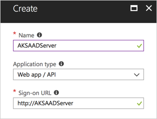

2. Select **Manifest** and edit the `groupMembershipClaims` value to `"All"`.

  Save the updates once complete.

  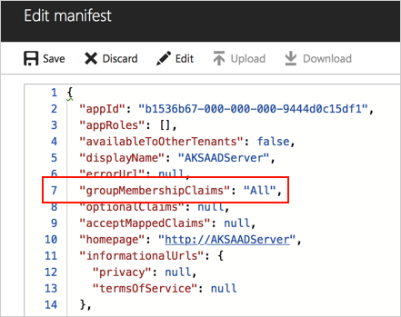

3. Back on the Azure AD application, select **Settings** > **Keys**.

  Add a key description, select an expiration deadline, and select **Save**. Take note of the key value. When deploying an Azure AD enabled AKS cluster, this value is referred to as the `Server application secret`.

  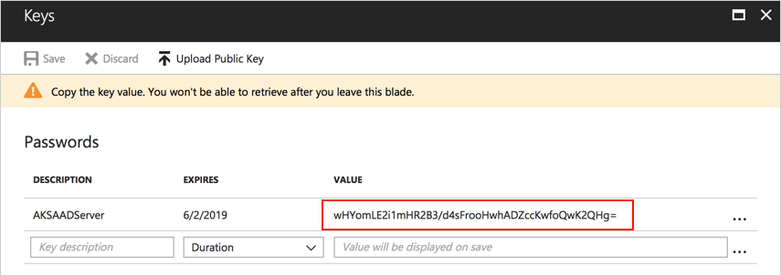

4. Return to the Azure AD application, select **Settings** > **Required permissions** > **Add** > **Select an API** > **Microsoft Graph** > **Select**.

  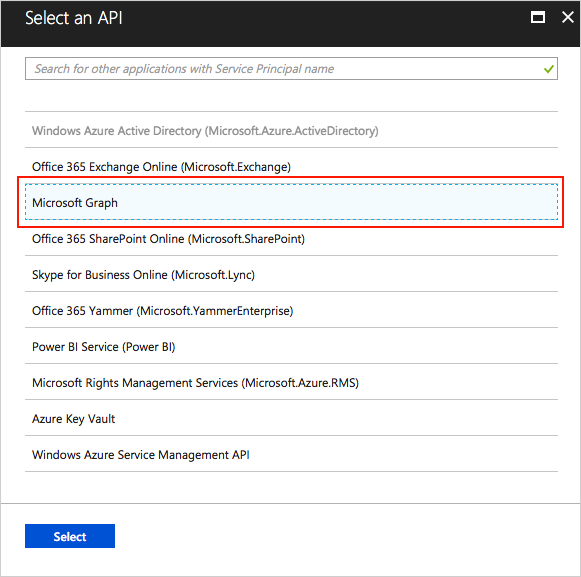

5. Under **APPLICATION PERMISSIONS** place a check next to **Read directory data**.

  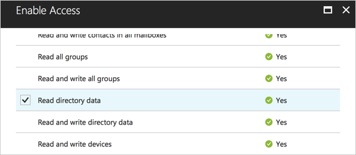

6. Under **DELEGATED PERMISSIONS**, place a check next to **Sign in and read user profile** and **Read directory data**. Save the updates once done.

  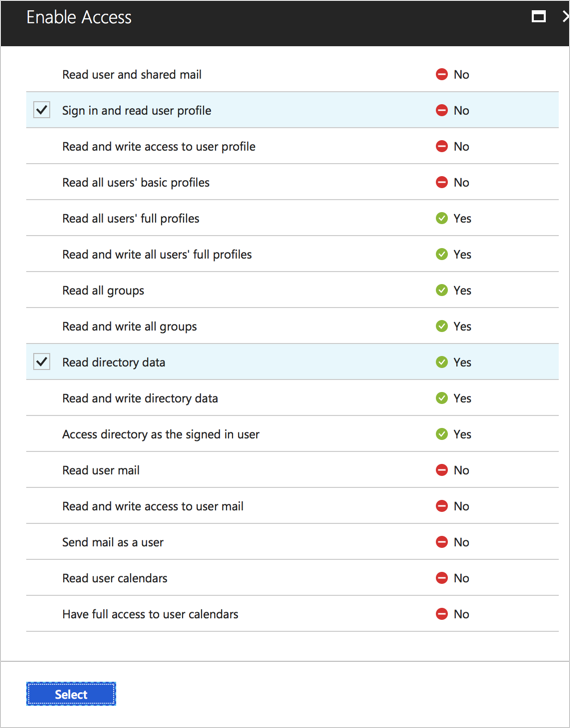

7. Select **Done**, choose *Microsoft Graph* from the list of APIs, then select **Grant Permissions**. This step will fail if the current account is not a tenant admin.

  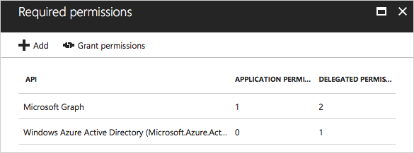

8. Return to the application and take note of the **Application ID**. When deploying an Azure AD-enabled AKS cluster, this value is referred to as the `Server application ID`.

  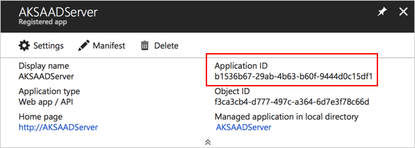

## Create client application

The second Azure AD application is used when logging in with the Kubernetes CLI (kubectl.)

1. Select **Azure Active Directory** > **App registrations** > **New application registration**.

  Give the application a name, select **Native** for the application type, and enter any URI formatted value for **Redirect URI**. Select **Create** when done.

  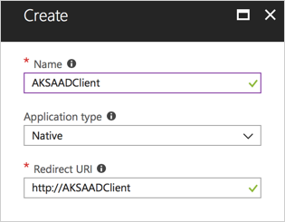

2. From the Azure AD application, select **Settings** > **Required permissions** > **Add** > **Select an API** and search for the name of the server application created in the last step of this document.

  

3. Place a check mark next to the application and click **Select**.

  

4. Select **Done** and **Grant Permissions** to complete this step.

  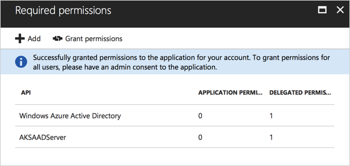

5. Back on the AD application, take note of the **Application ID**. When deploying an Azure AD-enabled AKS cluster, this value is referred to as the `Client application ID`.

  

## Get tenant ID

Finally, get the ID of your Azure tenant. This value is also used when deploying the AKS cluster.

From the Azure portal, select **Azure Active Directory** > **Properties** and take note of the **Directory ID**. When deploying an Azure AD-enabled AKS cluster, this value is referred to as the `Tenant ID`.

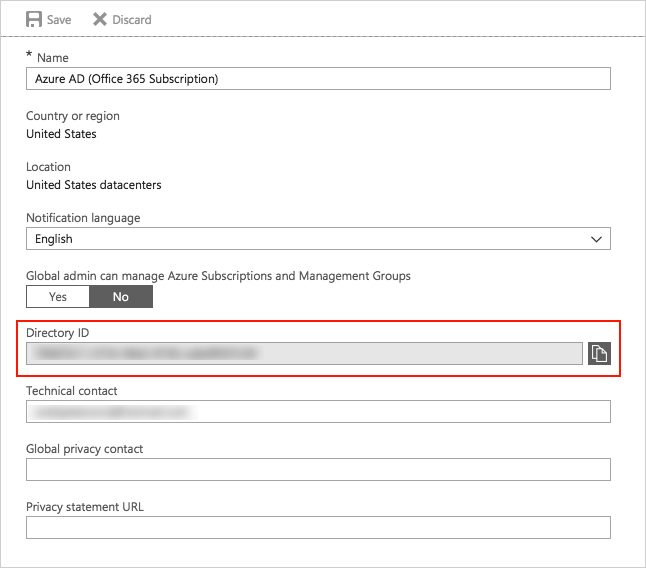

## Deploy Cluster

Use the [az group create][az-group-create] command to create a resource group for the AKS cluster.

```azurecli
az group create --name myAKSCluster --location eastus
```

Deploy the cluster using the [az aks create][az-aks-create] command. Replace the values in the sample command below with the values collected when creating the Azure AD applications.

```azurecli
az aks create --resource-group myAKSCluster --name myAKSCluster --generate-ssh-keys --enable-rbac \
  --aad-server-app-id 7ee598bb-0000-0000-0000-83692e2d717e \
  --aad-server-app-secret wHYomLe2i1mHR2B3/d4sFrooHwADZccKwfoQwK2QHg= \
  --aad-client-app-id 7ee598bb-0000-0000-0000-83692e2d717e \
  --aad-tenant-id 72f988bf-0000-0000-0000-2d7cd011db47
```

## Create RBAC binding

Before an Azure Active Directory account can be used with the AKS cluster, a role binding or cluster role binding needs to be created.

First, use the [az aks get-credentials][az-aks-get-credentials] command with the `--admin` argument to log in to the cluster with admin access.

```azurecli
az aks get-credentials --resource-group myAKSCluster --name myAKSCluster --admin
```

Next, use the following manifest to create a ClusterRoleBinding for an Azure AD account. Update the user name with one from your Azure AD tenant. This example gives the account full access to all namespaces of the cluster.

```yaml
apiVersion: rbac.authorization.k8s.io/v1
kind: ClusterRoleBinding
metadata:
  name: contoso-cluster-admins
roleRef:
  apiGroup: rbac.authorization.k8s.io
  kind: ClusterRole
  name: cluster-admin
subjects:
- apiGroup: rbac.authorization.k8s.io
  kind: User
  name: "user@contoso.com"
```

A role binding can also be created for all members of an Azure AD group. Azure AD groups are specified using the group object ID.

 ```yaml
apiVersion: rbac.authorization.k8s.io/v1
kind: ClusterRoleBinding
metadata:
  name: contoso-cluster-admins
roleRef:
  apiGroup: rbac.authorization.k8s.io
  kind: ClusterRole
  name: cluster-admin
subjects:
- apiGroup: rbac.authorization.k8s.io
   kind: Group
   name: "894656e1-39f8-4bfe-b16a-510f61af6f41"
```

For more information on securing a Kubernetes cluster with RBAC, see [Using RBAC Authorization][rbac-authorization].

## Access cluster with Azure AD

Next, pull the context for the non-admin user using the [az aks get-credentials][az-aks-get-credentials] command.

```azurecli
az aks get-credentials --resource-group myAKSCluster --name myAKSCluster
```

After running any kubectl command, you will be prompted to authenticate with Azure. Follow the on-screen instructions.

```console
$ kubectl get nodes

To sign in, use a web browser to open the page https://microsoft.com/devicelogin and enter the code BUJHWDGNL to authenticate.

NAME                       STATUS    ROLES     AGE       VERSION
aks-nodepool1-42032720-0   Ready     agent     1h        v1.9.6
aks-nodepool1-42032720-1   Ready     agent     1h        v1.9.6
aks-nodepool1-42032720-2   Ready     agent     1h        v1.9.6
```

Once complete, the authentication token is cached. You are only reprompted to log in when the token has expired or the Kubernetes config file re-created.

If you are seeing an authorization error message after signing in successfully, check that the user you are signing in as is not a Guest in the Azure AD (this is often the case if you are using a federated login from a different directory).
```console
error: You must be logged in to the server (Unauthorized)
```


## Next Steps

Learn more about securing Kubernetes clusters with RBAC with the [Using RBAC Authorization][rbac-authorization] documentation.

<!-- LINKS - external -->
[kubernetes-webhook]:https://kubernetes.io/docs/reference/access-authn-authz/authentication/#webhook-token-authentication
[rbac-authorization]: https://kubernetes.io/docs/reference/access-authn-authz/rbac/

<!-- LINKS - internal -->
[az-aks-create]: /cli/azure/aks?view=azure-cli-latest#az-aks-create
[az-aks-get-credentials]: /cli/azure/aks?view=azure-cli-latest#az_aks_get_credentials
[az-group-create]: /cli/azure/group#az_group_create
[open-id-connect]: ../active-directory/develop/active-directory-protocols-openid-connect-code.md
