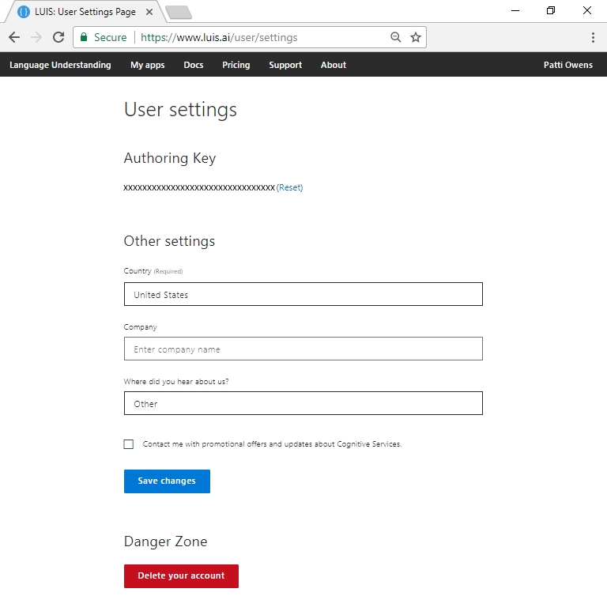
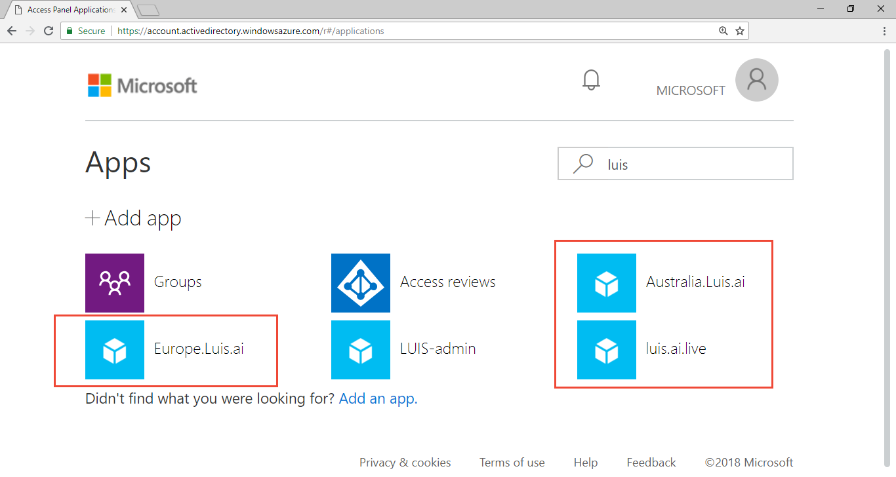

# Manage account and authoring key
The two key pieces of information for a LUIS account are the user account and the authoring key. Your login information is managed at [account.microsoft.com](https://account.microsoft.com). Your authoring key is managed from the [LUIS](luis-reference-regions.md) website **Settings** page. 

## Authoring key

This single, region-specific authoring key, on the **Settings** page, allows you to author all your apps from the [LUIS](luis-reference-regions.md) website as well as the [authoring APIs](https://aka.ms/luis-authoring-api). As a convenience, the authoring key is allowed to make a [limited](luis-boundaries.md) number of endpoint queries each month. 

The authoring key is used for any apps you own as well as any apps you are listed as a collaborator.

## Authoring key regions
The authoring key is specific to the [authoring region](luis-reference-regions.md#publishing-regions). The key does not work in a different region. 

## Reset authoring key
If your authoring key is compromised, reset the key. The key is reset on all your apps in the [LUIS](luis-reference-regions.md) website. If you author your apps via the authoring APIs, you need to change the value of `Ocp-Apim-Subscription-Key` to the new key. 

## Delete account
See [Data storage and removal](luis-concept-data-storage.md#accounts) for information about what data is deleted when you delete your account. 

## Azure Active Directory tenant user
LUIS uses standard Azure Active Directory (Azure AD) consent flow. 

The tenant admin should work directly with the user who needs access granted to use LUIS in the Azure AD. 

First, the user signs into LUIS, and sees the pop-up dialog needing admin approval. The user contacts the tenant admin before continuing. 

Second, the tenant admin signs into LUIS, and sees a consent flow pop-up dialog. This is the dialog the admin needs to give permission for the user. Once the admin accepts the permission, the user is able to continue with LUIS.

If the tenant admin will not sign in to LUIS, the admin can access [consent](https://account.activedirectory.windowsazure.com/r#/applications) for LUIS. 

If the tenant admin only wants certain users to use LUIS, refer to this [identity blog](https://blogs.technet.microsoft.com/tfg/2017/10/15/english-tips-to-manage-azure-ad-users-consent-to-applications-using-azure-ad-graph-api/).

### User accounts with multiple emails for collaborators
If you add collaborators to a LUIS app, you are specifying the exact email address a collaborator needs to use LUIS as a collaborator. While Azure Active Directory (Azure AD) allows a single user to have more than one email account used interchangeably, LUIS requires the user to log in with the email address specified in the collaborator's list. 

## Next steps

Learn more about your [authoring key](luis-concept-keys.md#authoring-key). 

